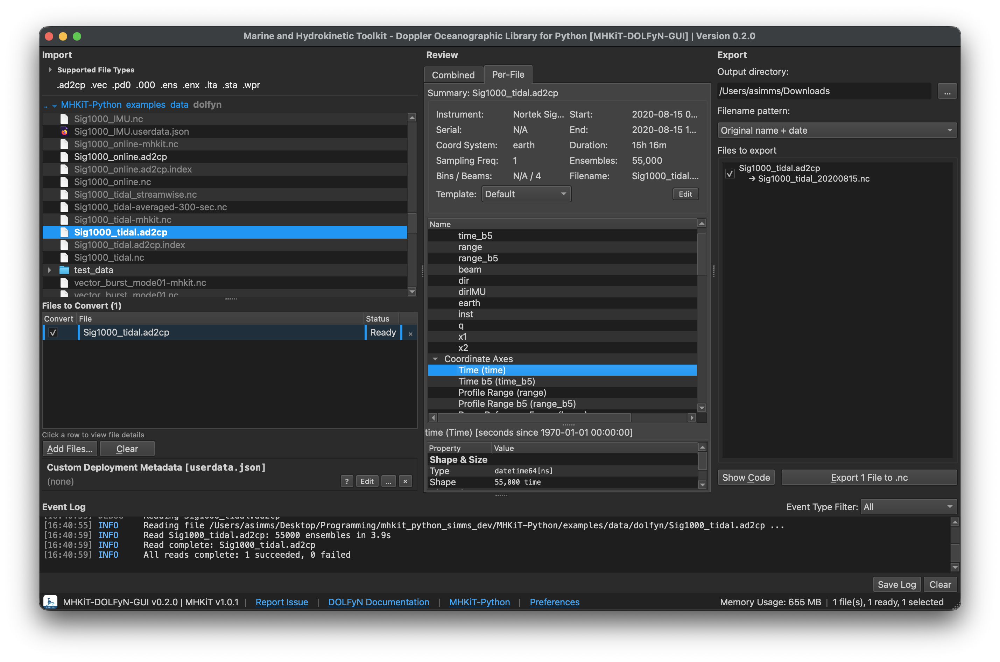
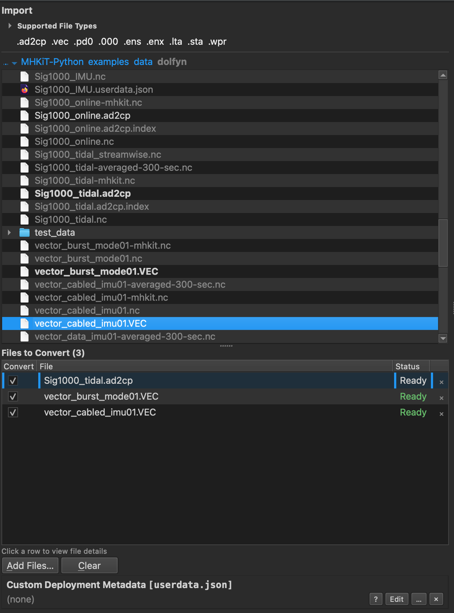
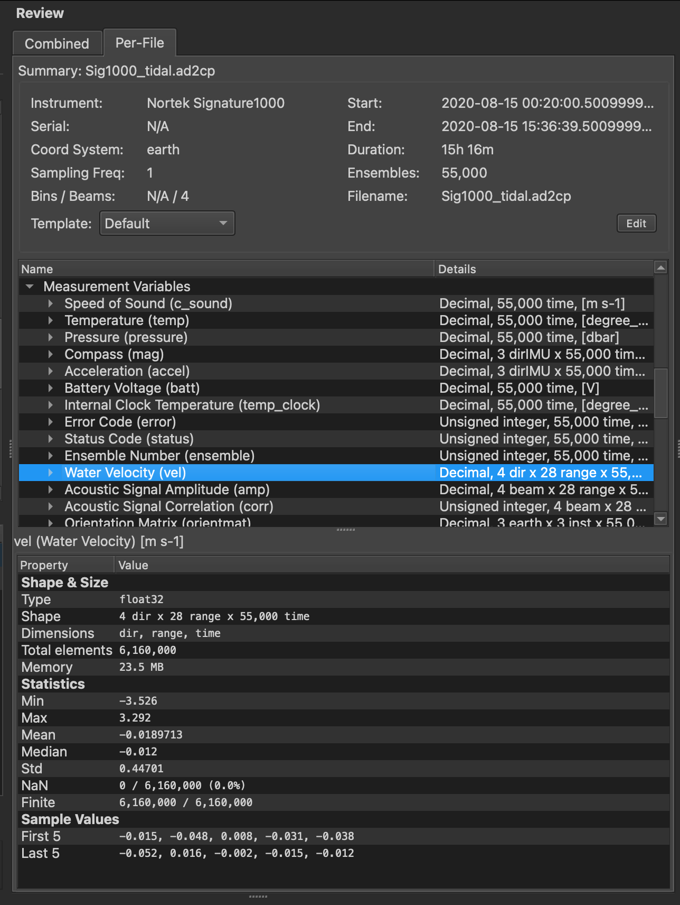
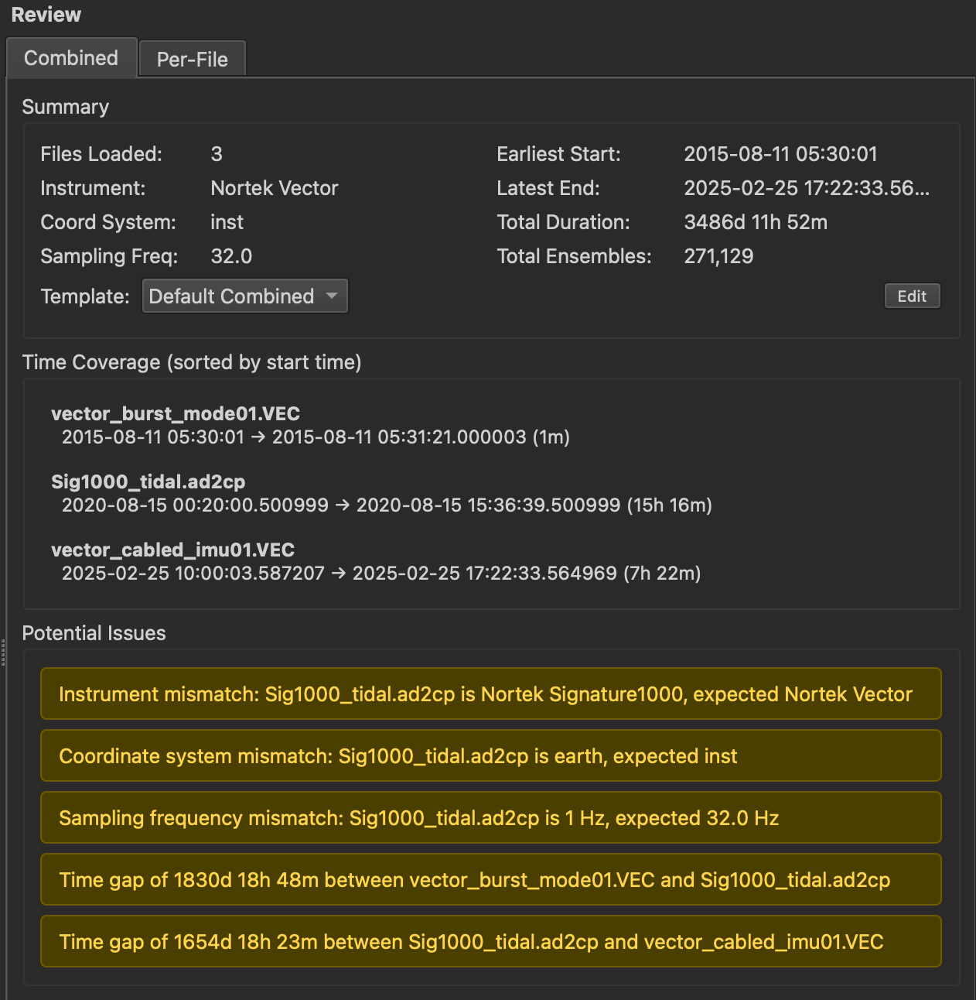
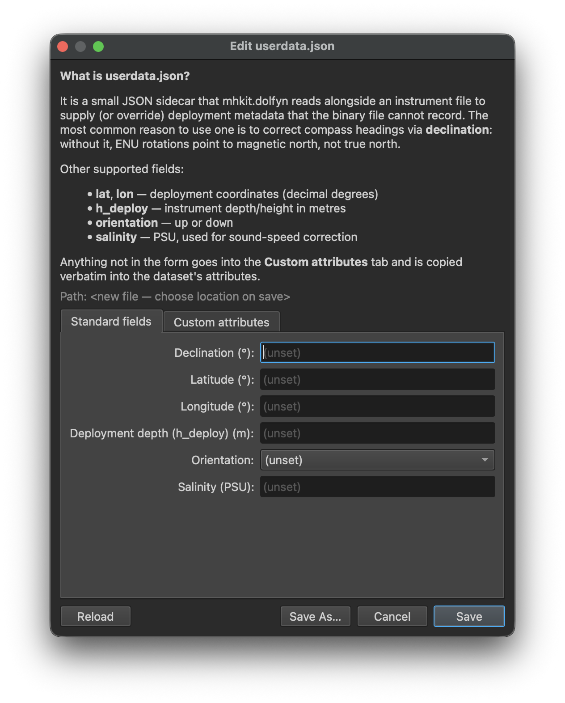
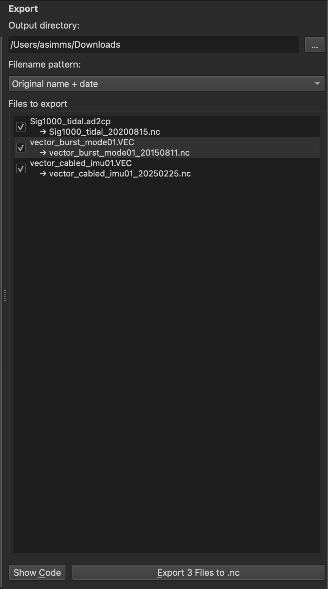
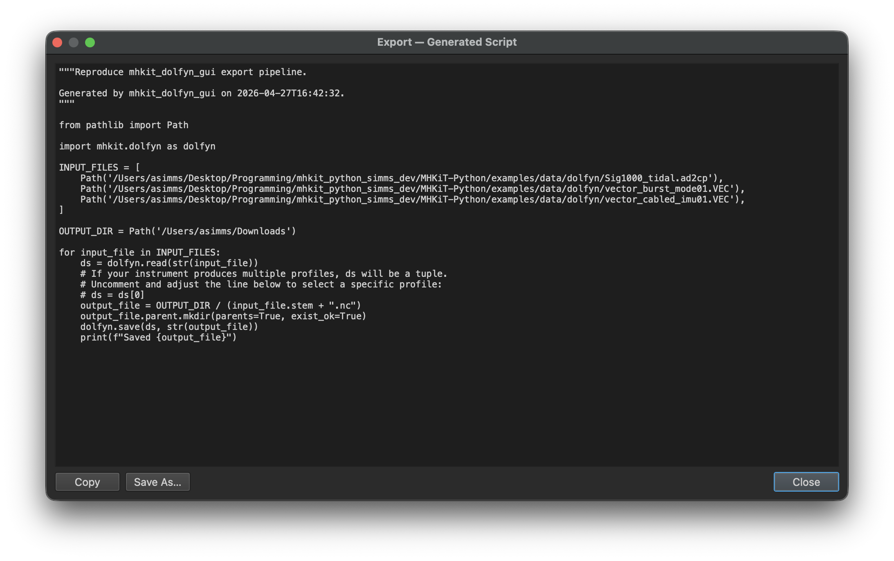
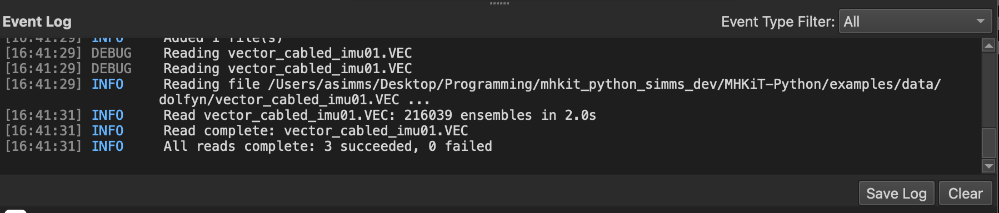
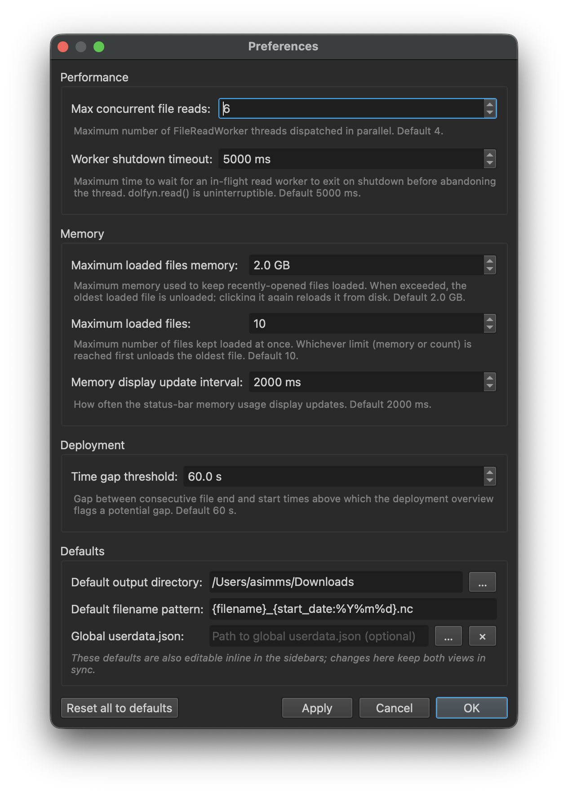

# MHKiT-DOLFyN GUI

A desktop GUI for converting ADCP and ADV binary instrument files to standardized NetCDF, `.nc` files. It wraps
[`mhkit.dolfyn`](https://mhkit-software.github.io/MHKiT/mhkit-python/api.dolfyn.html) —
the Doppler Oceanographic Library for Python included in
[MHKiT-Python](https://github.com/MHKiT-Software/MHKiT-Python) — so you can read, inspect, and
export instrument data without writing any code.



## Workflow

### 1. Import files

Browse your filesystem and add binary instrument files to the conversion queue. Supported formats
include `.ad2cp`, `.vec`, `.pd0`, `.000`, `.ens`, `.enx`, `.lta`, `.sta`, and `.wpr` (Nortek,
Teledyne RDI, and other instruments supported by `mhkit.dolfyn`). Files load in parallel and appear in the
queue with a **Ready** status as soon as they converted into an intermediate format (xarray Dataset)
for analysis prior to export.



### 2. Review datasets

The **Review** panel shows a dataset summary for each file. Switch to the **Per-File** tab to
browse every variable, dimension, and coordinate axis; click any variable to see its shape, type,
statistics, and sample values.



When multiple files are loaded, the **Combined** tab gives a deployment-level overview: total
time coverage, ensemble counts, and automatic warnings for instrument mismatches, coordinate-system
differences, or unexpected time gaps between files.



### 3. Add deployment metadata (optional)

Use the **Custom Deployment Metadata** editor to create or attach a `userdata.json` sidecar file.
This lets you supply information the binary file cannot record — magnetic declination (required for
true-north ENU rotations), deployment coordinates, instrument depth, orientation, and salinity.
`mhkit.dolfyn` reads this file automatically alongside the binary data.



### 4. Export to NetCDF

Configure an output directory and filename pattern in the **Export** panel, select which files to
include, and click **Export**. Each file is saved as a self-describing NetCDF (`.nc`) using
`mhkit.dolfyn`.



**Show Code** generates a standalone Python script that reproduces the exact same conversion —
useful for scripted pipelines or sharing reproducible workflows.



### Event log and preferences

The **Event Log** at the bottom of the window logs events with timestamps. Useful for tracking file
processing and exporting actions.



**Preferences** (status bar → _Preferences_) lets you tune concurrent read threads, the in-memory
dataset cache, time-gap detection thresholds, and default output paths.



## Installation

MHKiT-DOLFyN GUI requires [Python 3.11+](https://www.python.org/). It is recommended to use
[Miniconda](https://docs.anaconda.com/miniconda/) or the
[Anaconda Python Distribution](https://www.anaconda.com/distribution/).

### Option 1: Run from source (recommended)

Clone the repo and create the Conda environment. `environment.yml` installs all runtime
dependencies (mhkit, PySide6, netCDF4, HDF5, PyYAML, psutil), so you can launch immediately
with `run.py` — no package install needed.

```bash
git clone https://github.com/MHKiT-Software/mhkit_dolfyn_pyqt_gui
```

```bash
cd mhkit_dolfyn_pyqt_gui
```

```bash
conda env create -f environment.yml
```

```bash
conda activate mhkit-dolfyn-gui
```

```bash
python run.py
```

### Option 2: Build a standalone app bundle (PyInstaller)

Produces a self-contained `MHKiT-DOLFyN.app` (macOS) or `MHKiT-DOLFyN.exe` (Windows) in `dist/`
that runs without a Python environment. Start from the Option 1 setup steps, then:

```bash
pip install -e ".[dev]"
```

```bash
pyinstaller mhkit_dolfyn.spec --noconfirm
```

The built bundle will be at `dist/MHKiT-DOLFyN/` (or `dist/MHKiT-DOLFyN.app` on macOS).

### Option 3: pip install with CLI entry point

Install the package to get the `mhkit-dolfyn-gui` command available anywhere on your PATH.
Start from the Option 1 setup steps, then:

```bash
pip install -e .
```

Then launch from any directory:

```bash
mhkit-dolfyn-gui
```

## Development

Install with development dependencies:

```bash
pip install -e ".[dev]"
```

Run tests, linting, and formatting checks:

```bash
ruff check src/ tests/
ruff format --check src/ tests/
pytest -v
```

## Copyright and license

MHKiT-DOLFyN GUI is copyright through the National Laboratory of the Rockies,
Pacific Northwest National Laboratory, and Sandia National Laboratories.
The software is distributed under the Revised BSD License.
See [copyright and license](LICENSE.md) for more information.
