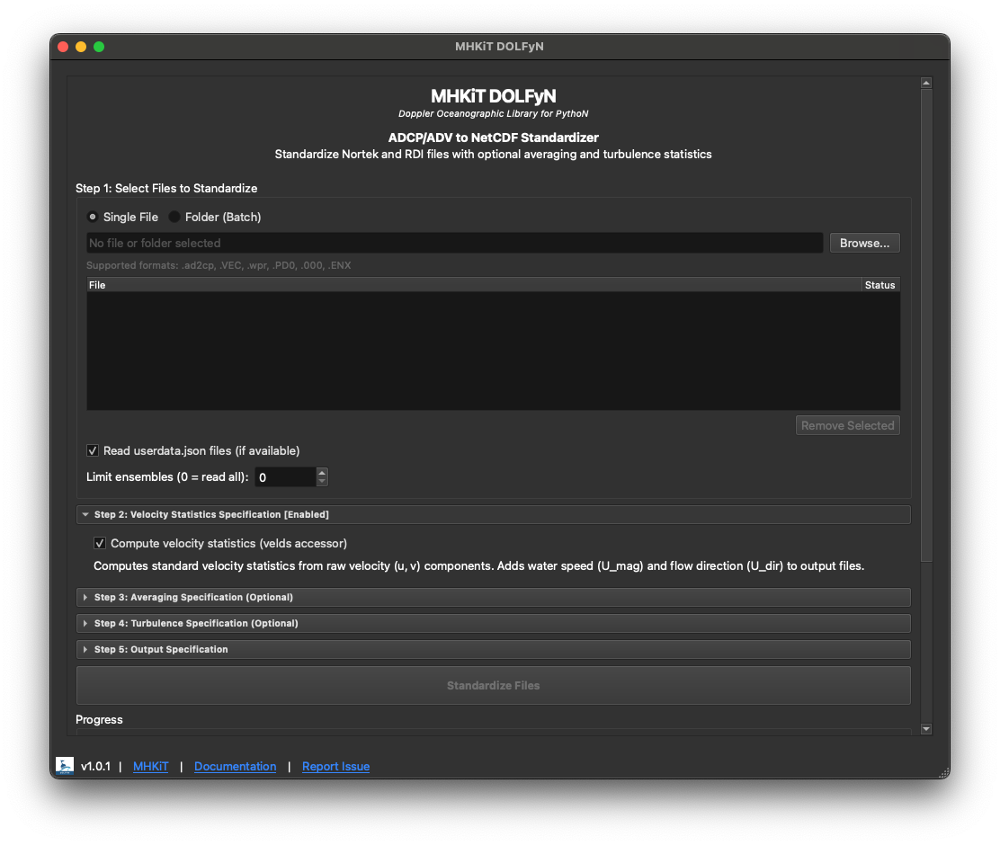

# MHKiT-DOLFyN GUI

A PyQt6 desktop application for batch standardization of ADCP and ADV data files to NetCDF (`.nc`) files using the [MHKiT-DOLFyN](https://github.com/MHKiT-Software/MHKiT-Python) library.



## Features

- Batch processing of ADCP/ADV files with drag-and-drop support
- Quality control configuration (surface interference removal, correlation filtering, coordinate rotation)
- Configurable time averaging
- Time partitioning (duration-based, time-of-day, ensemble count)
- Turbulence statistics computation (shear, Reynolds stress, dissipation rates, friction velocity)
- Cross-platform (macOS, Windows, Linux)

## Supported File Formats

DOLfyn identifies instruments by binary file content, not by extension. File extensions are **not case-sensitive**.

### ADCP (Acoustic Doppler Current Profiler)

| Extension | Manufacturer | Instrument                                           |
| --------- | ------------ | ---------------------------------------------------- |
| `.ad2cp`  | Nortek       | Signature series (Signature 55, 100, 250, 500, 1000) |
| `.wpr`    | Nortek       | AWAC                                                 |
| `.000`    | Teledyne RDI | Workhorse, Sentinel, etc. (raw binary)               |
| `.PD0`    | Teledyne RDI | PD0 binary (WinRiver export)                         |
| `.ENX`    | Teledyne RDI | WinRiver processed ensembles                         |
| `.ENR`    | Teledyne RDI | WinRiver raw ensembles                               |

### ADV (Acoustic Doppler Velocimeter)

| Extension | Manufacturer | Instrument |
| --------- | ------------ | ---------- |
| `.VEC`    | Nortek       | Vector     |

## Installation

### Prerequisites

- [Conda](https://docs.conda.io/en/latest/) (Miniconda or Anaconda)

### Setup

Download or clone this repository, then open a terminal and navigate to the project folder:

```bash
cd path/to/mhkit_dolfyn_pyqt_gui
conda env create -f environment.yml
```

### Running

Each time you want to run the application, open a terminal, navigate to the project folder, and run:

```bash
cd path/to/mhkit_dolfyn_pyqt_gui
conda activate mhkit-gui-qt
python main.py
```

1. Drag and drop your ADCP/ADV files into the file list (or use **File > Add Files**).
2. Configure quality control, time averaging, and partitioning options as needed.
3. Click **Run** to batch-process your files to NetCDF.

### Building a Standalone Executable (Experimental)

> **Note:** Standalone builds are experimental and may not work on all systems. Running from source (above) is recommended.

Install the dev dependencies, then run PyInstaller with the included spec file:

```bash
pip install -e ".[dev]"
pyinstaller mhkit_dolfyn_gui.spec
```

The bundled application will be in the `dist/` directory.

On **macOS**, you must remove the quarantine attribute before the `.app` will launch:

```bash
xattr -d com.apple.quarantine "MHKiT-DOLFyN GUI.app"
```

## License

This project is licensed under the BSD 3-Clause License. See [LICENSE](LICENSE) for details.
